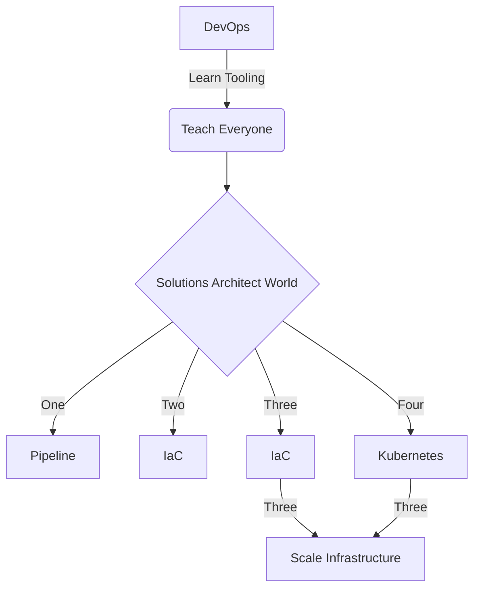

# Playing Around with Diagram As A Code 

```mermaid
graph TD
    A[DevOps] -->|Learn Tooling| B(Teach Everyone)
    B --> C{Solutions Architect World}
    C -->|One| D[Pipeline]
    C -->|Two| E[IaC]
    C -->|Three| F[IaC]
    F -->|Three| H[Scale Infrastructure]
    C -->|Four| G[Kubernetes]
    G -->|Three| H[Scale Infrastructure]
```
  